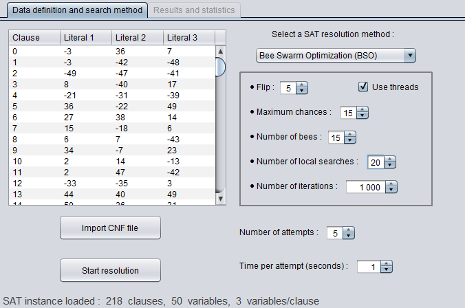
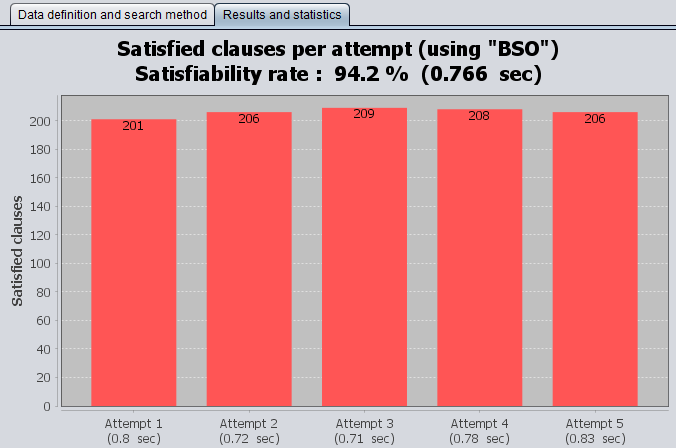

# Intelligent SAT Solver

> An implementation of different approaches to solve the satisfiability problem (SAT) using blind, heuristic and metaheuristic methods.

## General info

project started in **February 2019** (in progress) as a university practical work, field : *Artificial Intelligence (AI)*, level : *Master 1*. The goal is to use different algorithms which implement blind search methods (depth first and breadth first), heuristic methods (A\*) and metaheuristics (GA, BSO and PSO) to find solutions for instances of the [SAT problem](https://en.wikipedia.org/wiki/Boolean_satisfiability_problem).

## ScreenShots

<p align="center">
    
    
</p>

## Project content

```text
.
├── examples                                           <- Contains test files for the SAT solver
│      ├── uf20-01.cnf / uf50-01.cnf / uf75-01.cnf     <- Benchmark files (SAT instances)
│      └── dataSearchMethod.png / resultsStats.png     <- Images used as illustration
│
├── src                          <- Contains Java source-code of the project
│    ├── main                    <- Contains general classes used in other packages (with "main()" method)
│    ├── gui                     <- Contains the GUI (the frame and its components)
│    ├── blindSearch             <- Contains the implementation of DFS and BFS searches
│    ├── heuristicSearch         <- Contains the implementation of different heuristic algorithms
│    ├── ga                      <- Contains the implementation of GA metaheuristic search method
│    ├── bso                     <- Contains the implementation of BSO metaheuristic search method
│    ├── pso                     <- Contains the implementation of PSO metaheuristic search method
│    └── JFreeChart-1.5.0.jar    <- External library used to generate statistical graphs
│
└── README.md                    <- Current project information
```

## Technologies

- **Java** (with [JFreeChart](https://github.com/jfree/jfreechart) [Swing doesn't support graphs natively]. Used version : *JDK 8*).

## Build

To run this project, make sure that you have at least ***JDK 8*** already installed. Then, if you're using an IDE, just import the *"src"* directory into a *"new java project"* (with *"JFreeChart"* as an external *JAR*). Otherwise, if you prefer the *"command-line" (terminal)*, go to the root of the project and follow these steps :

```bash
# Create a destination directory for the compiled ".java" files
$ mkdir bin

# Go to the "source-code" directory
$ cd src

# Compile all ".java" files with the external Jar "JFreeChart" (For Windows, replace ':' with ';')
$ javac -d "../bin" -cp ".:JFreeChart-1.5.0.jar" main/*.java gui/*.java blindSearch/*.java heuristicSearch/*.java ga/*.java bso/*.java pso/*.java

# Go back to the root directory
$ cd ..

# Execute the main class (Application) with the external JAR "JFreeChart" (For Windows, replace ':' with ';')
$ java -cp "bin:src/JFreeChart-1.5.0.jar" main/Application
```

## Application use

To use this application, you have to import a SAT instance (a set of clauses) in *DIMACS CNF* format, some examples can be found in ***examples/*** directory. For more benchmarks, visit : [SATLIB - Benchmark Problems](https://www.cs.ubc.ca/~hoos/SATLIB/benchm.html).

## Features

- *Implementation of different resolution approaches for the SAT problem :*
  - *Blind, complete search methods* :
    - [Depth-First Search](https://en.wikipedia.org/wiki/Depth-first_search) (DFS).
    - [Breadth-First Search](https://en.wikipedia.org/wiki/Breadth-first_search) (BFS).
  - [Heuristic](https://en.wikipedia.org/wiki/Heuristic_(computer_science)) search methods [(A\* algorithms)](https://en.wikipedia.org/wiki/A*_search_algorithm). *[Other algorithms will be added later]*
  - [Genetic Algorithm](https://en.wikipedia.org/wiki/Genetic_algorithm) (GA).
  - [Bee Swarm Optimization](http://www.lria.usthb.dz/IMG/pdf/chapter_2._bso-2.pdf) (BSO) [metaheuristic](https://en.wikipedia.org/wiki/Metaheuristic) search method.
  - [Particle Swarm Optimization](https://en.wikipedia.org/wiki/Particle_swarm_optimization) (PSO) metaheuristic search method.
- *A simple GUI for solving the SAT problem :*
  - Import a CNF file and display its content (number of clauses and variables/literals of each clause).
  - Choose the method of resolution and its parameters.
  - Display the resolution result in the form of bar chart and associated statistics.

## To do list

- Implement other efficient heuristic search (A\*) algorithms to solve the SAT problem.

## Status

Project in progress. So, the different tasks of the "*to do list*" will be realized progressively.
